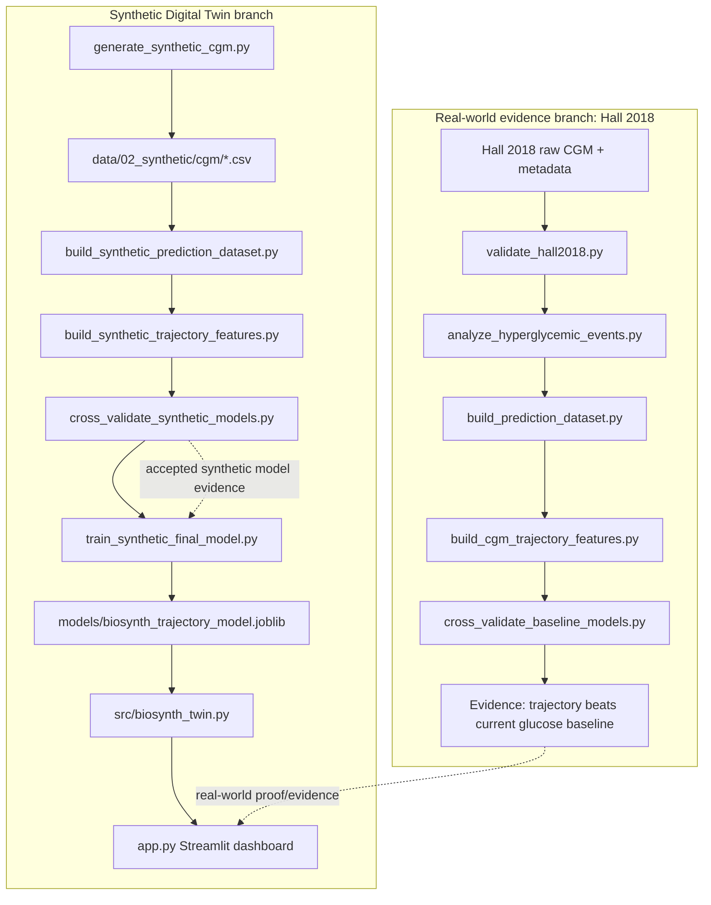

# BioSynth Technical Guide

Last updated: 2026-10-08

This guide explains the current BioSynth / Digital Twin proof of concept from end to end. It is written for someone who knows basic programming but is new to machine learning, continuous glucose monitor data, feature engineering, cross-validation, and Digital Twins.

BioSynth is a hackathon proof of concept. It is not clinically validated, and nothing in this repository should be used for medical decision-making.

## 1. What BioSynth Is

In plain English, BioSynth watches recent glucose readings and estimates whether glucose is likely to cross a proof-of-concept threshold soon.

The current system predicts this exact event:

> Will a new glucose threshold-crossing event begin within the next 120 minutes?

Current engineering definitions:

| Concept | Current implementation |
| --- | --- |
| Input signal | CGM time series |
| History window | 60 minutes of prior CGM readings |
| Prediction horizon | 120 minutes into the future |
| POC threshold | glucose >180 mg/dL |
| Target label | `pre_event_target` |
| Runtime model input | 18 CGM trajectory features |

"Pre-event prediction" means the model is meant to warn before a new threshold-crossing event begins. If glucose is already above 180 mg/dL, the event is underway; the dashboard now shows that as `ABOVE POC THRESHOLD` rather than presenting the pre-event probability as ordinary future risk.

The Digital Twin in this project is a continuously updated virtual state derived from CGM history. It is not a full body simulation. Right now it represents glucose trajectory state: current glucose, recent movement, near-term threshold-crossing risk, and display states.

There are two data branches:

- Hall 2018 real CGM branch: used as real-world evidence that trajectory features contain useful signal.
- Synthetic CGM branch: used to build, train, and demonstrate the hackathon Digital Twin runtime in a privacy-safe, controlled setting.

The final dashboard runtime model is trained on the synthetic trajectory feature dataset, not Hall 2018.

## 2. The Entire System In One Flow



The Hall branch answers: "Does CGM trajectory show predictive signal on real-world CGM?"

The synthetic branch answers: "Can we build a controlled Digital Twin demo that replays virtual participants and calls a real runtime model?"

## 3. Repository Map

Relevant current structure:

```text
digital-twin-poc/
├── app.py
├── README.md
├── LICENSE
├── requirements.txt
├── configs/
│   ├── data_sources.yaml
│   ├── default.yaml
│   └── model_config.yaml
├── data/
│   └── 02_synthetic/
│       ├── cgm/
│       │   ├── SYN-0001.csv
│       │   └── ... SYN-0100.csv
│       └── metadata/
│           ├── synthetic_events.csv
│           └── synthetic_participants.csv
├── docs/
│   ├── api_reference.md
│   ├── architecture.md
│   ├── data_dictionary.md
│   ├── model_card.md
│   └── BIOSYNTH_TECHNICAL_GUIDE.md
├── models/
│   ├── biosynth_trajectory_model.joblib
│   └── biosynth_trajectory_model_metadata.json
├── reports/
│   ├── hall2018_*.csv/json
│   ├── synthetic_*.csv/json
│   └── synthetic_cgm_sample_trajectories.png
├── scripts/
│   ├── validate_hall2018.py
│   ├── analyze_hyperglycemic_events.py
│   ├── build_prediction_dataset.py
│   ├── build_cgm_trajectory_features.py
│   ├── cross_validate_baseline_models.py
│   ├── generate_synthetic_cgm.py
│   ├── build_synthetic_prediction_dataset.py
│   ├── build_synthetic_trajectory_features.py
│   ├── cross_validate_synthetic_models.py
│   ├── train_synthetic_final_model.py
│   └── demo_digital_twin.py
├── src/
│   ├── __init__.py
│   └── biosynth_twin.py
├── tests/
│   └── __init__.py
└── ui/
    └── app.py
```

Folder roles:

| Folder | Role |
| --- | --- |
| `data/` | Input and generated datasets. The synthetic raw CGM lives under `data/02_synthetic/`. |
| `scripts/` | One-off pipeline steps: validation, data generation, labels, features, model evaluation, final model training, demo CLI. |
| `src/` | Runtime code imported by applications. `src/biosynth_twin.py` is the reusable Digital Twin runtime. |
| `models/` | Saved deployment/demo model artifacts. |
| `reports/` | Generated CSV/JSON/PNG outputs from pipeline steps. |
| `docs/` | Human-readable documentation. |
| `app.py` | Current judge-facing Streamlit dashboard. |
| `ui/app.py` | Older placeholder UI file; the current dashboard is root `app.py`. |

## 4. File-by-File Guide

| File | Purpose | Reads/Input | Produces/Output | Used By | When It Runs |
| --- | --- | --- | --- | --- | --- |
| `README.md` | Project overview and handoff context | Human updates and reports | Human-readable project state | Developers/judges | Read anytime |
| `docs/BIOSYNTH_TECHNICAL_GUIDE.md` | Standalone technical walkthrough | Actual repository files | This guide | New contributors | Read anytime |
| `data/02_synthetic/cgm/SYN-*.csv` | Raw synthetic participant CGM files | Generated by simulator | `timestamp`, `glucose_value_mg_dl` rows | Synthetic pipeline, runtime demo | Generated once; read often |
| `data/02_synthetic/metadata/synthetic_participants.csv` | Synthetic participant metadata | Simulator parameters | Participant rows and simulation phenotype/context | Synthetic analysis and summaries | Generated by `generate_synthetic_cgm.py` |
| `data/02_synthetic/metadata/synthetic_events.csv` | Simulator ground-truth disturbances | Simulator events | Meal/disturbance metadata | Analysis only, not model features | Generated by `generate_synthetic_cgm.py` |
| `scripts/generate_synthetic_cgm.py` | Synthetic raw CGM generation | Fixed simulator settings | `data/02_synthetic/cgm/`, metadata, generation summary | Synthetic branch | Data preparation |
| `scripts/analyze_synthetic_cgm.py` | Sanity analysis of generated synthetic CGM | Synthetic raw CGM + metadata | `reports/synthetic_cgm_analysis.csv`, JSON, PNG | Human review | Analysis/validation |
| `scripts/build_synthetic_prediction_dataset.py` | Builds synthetic prediction rows and detects events from raw CGM | Synthetic raw CGM and participant metadata | `reports/synthetic_prediction_dataset.csv`, detected events, summary | Synthetic feature builder | Data preparation/label construction |
| `scripts/build_synthetic_trajectory_features.py` | Builds 18 leakage-safe trajectory features for synthetic prediction rows | Synthetic prediction dataset + raw CGM | `reports/synthetic_cgm_trajectory_features.csv`, summary | Synthetic model evaluation and final training | Feature engineering |
| `scripts/cross_validate_synthetic_models.py` | Participant-separated synthetic model comparison | Synthetic trajectory features | OOF predictions, CV results, summary | Evidence for model choice | Model evaluation |
| `scripts/train_synthetic_final_model.py` | Fits final full-data synthetic runtime model | Synthetic trajectory features | `models/biosynth_trajectory_model.joblib`, metadata JSON | BioSynthTwin runtime | Final model training |
| `src/biosynth_twin.py` | Reusable runtime class | Saved model + metadata + historical CGM input | State dictionary with risk/trend/glucose state | CLI demo and Streamlit dashboard | Runtime |
| `scripts/demo_digital_twin.py` | Command-line proof that runtime works | Synthetic CGM + event file for timestamp selection | Terminal Digital Twin state | Developer verification | Demo/UI |
| `app.py` | Current Streamlit dashboard | SYN-0085 CGM, event file, BioSynthTwin | Local visual dashboard | Judges/demo | Demo/UI |
| `models/biosynth_trajectory_model.joblib` | Serialized scikit-learn pipeline | Trained by final training script | Loadable runtime model | `BioSynthTwin` | Loaded at runtime |
| `models/biosynth_trajectory_model_metadata.json` | Model metadata | Final training script | Feature list, target, thresholds, OOF references | `BioSynthTwin`, humans | Loaded at runtime |
| `reports/synthetic_model_oof_predictions.csv` | Out-of-fold predictions | Synthetic CV | Row-level baseline and trajectory probabilities | Evidence/debugging | Generated by synthetic CV |
| `reports/synthetic_cross_validation_summary.json` | Synthetic CV summary | Synthetic CV | Metrics and subgroup results | README/guide | Generated by synthetic CV |
| `reports/synthetic_cgm_trajectory_features.csv` | Final synthetic model feature table | Feature builder | 198,000 rows with 18 features and label | CV and final training | Generated before modeling |
| `reports/synthetic_prediction_dataset.csv` | Synthetic supervised prediction rows | Synthetic prediction builder | Timestamps, labels, event status context | Feature builder | Generated before features |
| `reports/synthetic_detected_hyperglycemic_events.csv` | Events detected from synthetic raw CGM | Synthetic prediction builder | Event IDs/start/end/peak | Dashboard event selection only | Generated before demo |
| `scripts/validate_hall2018.py` | Validates real Hall 2018 dataset structure and data quality | Hall raw CGM and metadata | Hall validation reports | Hall branch | Data validation |
| `scripts/analyze_hyperglycemic_events.py` | Detects Hall hyperglycemic events | Hall raw CGM and metadata | Hall event CSV/JSON | Hall prediction builder | Data preparation |
| `scripts/build_prediction_dataset.py` | Builds Hall supervised prediction rows | Hall raw CGM, metadata, event file | Hall prediction dataset and summary | Hall feature builder | Label construction |
| `scripts/build_cgm_trajectory_features.py` | Builds Hall trajectory features | Hall prediction dataset + raw CGM | Hall trajectory features and summary | Hall CV | Feature engineering |
| `scripts/cross_validate_baseline_models.py` | Hall participant-separated model comparison | Hall trajectory features | Hall OOF predictions, CV results, summary | Real-world evidence | Model evaluation |
| `reports/hall2018_cross_validation_summary.json` | Hall evaluation summary | Hall CV | Real-world evidence metrics | README/guide | Generated by Hall CV |
| `requirements.txt` | Python dependencies | Manual/environment | Package list | Setup | Install time |

Pipeline dependency example:

```text
scripts/generate_synthetic_cgm.py
  -> data/02_synthetic/cgm/*.csv
  -> scripts/build_synthetic_prediction_dataset.py
  -> reports/synthetic_prediction_dataset.csv
  -> scripts/build_synthetic_trajectory_features.py
  -> reports/synthetic_cgm_trajectory_features.csv
  -> scripts/cross_validate_synthetic_models.py
  -> scripts/train_synthetic_final_model.py
  -> models/biosynth_trajectory_model.joblib
  -> src/biosynth_twin.py
  -> app.py
```

## 5. Data Journey: One CGM Reading To A Prediction

Concrete dashboard example:

| Item | Value |
| --- | --- |
| Participant | `SYN-0085` |
| Replay timestamp | `2026-01-04 12:10:00` |
| Current glucose | 176.5 mg/dL |
| Displayed pre-event risk | 94.6% |
| Risk state | HIGH |

1. The raw CGM row lives in `data/02_synthetic/cgm/SYN-0085.csv`. Each row has `timestamp` and `glucose_value_mg_dl`.

2. The dashboard reads that CSV in `app.py`.

3. At the selected replay timestamp, the dashboard creates:

   ```python
   historical_cgm = cgm[cgm["timestamp"] <= prediction_time]
   ```

   This excludes readings after `2026-01-04 12:10:00`.

4. The dashboard passes only that historical dataframe into:

   ```python
   BioSynthTwin.predict_state(historical_cgm, prediction_time)
   ```

5. `BioSynthTwin` selects the last 60 minutes of numeric CGM readings. At this timestamp it finds 13 readings over exactly 60 minutes.

6. Those readings become 18 trajectory features. For this example, the runtime calculated:

| Feature | Value |
| --- | ---: |
| `current_glucose_mg_dl` | 176.5 |
| `current_is_high` | 0 |
| `history_mean_glucose` | 177.05 |
| `history_median_glucose` | 175.3 |
| `history_min_glucose` | 161.9 |
| `history_max_glucose` | 193.7 |
| `history_range_glucose` | 31.8 |
| `glucose_change_15m` | +1.2 |
| `glucose_change_30m` | -15.1 |
| `glucose_change_60m` | +8.2 |
| `glucose_slope_per_hour` | +5.47 |
| `history_std_glucose` | 8.76 |
| `history_cv_glucose` | 0.049 |
| `history_high_count` | 4 |
| `history_high_fraction` | 0.308 |
| `history_minutes_above_180` | 20.0 |
| `trajectory_numeric_count` | 13 |
| `trajectory_actual_history_minutes` | 60.0 |

7. These 18 numbers enter the saved scikit-learn pipeline in `models/biosynth_trajectory_model.joblib`.

8. Median imputation fills any missing feature values with a median learned during training. In this example the important features are available, but imputation is still part of the pipeline for safety.

9. `StandardScaler` rescales features so values with large numeric ranges do not dominate only because of their units.

10. Logistic regression combines the scaled feature values using learned weights and converts the result into a probability.

11. `predict_proba` returns the estimated probability for `pre_event_target = 1`. Here it is about `0.9464`, displayed as 94.6%.

12. `BioSynthTwin` maps the probability to a demo display state:

    - risk <0.30: LOW
    - 0.30 <= risk <0.60: ELEVATED
    - risk >=0.60: HIGH

13. `app.py` displays the result as dashboard cards and a historical CGM chart.

14. At `2026-01-04 13:40:00`, the current glucose is 242.2 mg/dL. The threshold event is already underway. The underlying pre-event probability is still computed by the model, but the dashboard does not show it as LOW risk. It displays `Event underway` and `ABOVE POC THRESHOLD`.

## 6. The 18 Trajectory Features

Feature groups:

- Current level: what glucose is now.
- Trajectory/movement: how glucose has changed recently.
- Variability/history: what the recent 60-minute pattern looks like.

| Feature | Simple meaning | Why it might help | How it is calculated |
| --- | --- | --- | --- |
| `current_glucose_mg_dl` | Current numeric glucose | Current level still matters | Latest numeric glucose at prediction time |
| `current_is_high` | Whether current glucose is above threshold | Distinguishes current above-threshold state | 1 if current glucose >180, else 0 |
| `history_mean_glucose` | Average recent glucose | High recent average can indicate sustained elevation | Mean of numeric glucose in the 60-minute window |
| `history_median_glucose` | Middle recent glucose value | Robust recent level | Median of numeric glucose in the 60-minute window |
| `history_min_glucose` | Lowest recent glucose | Captures lower bound of recent pattern | Minimum glucose in the window |
| `history_max_glucose` | Highest recent glucose | Captures recent peaks | Maximum glucose in the window |
| `history_range_glucose` | Spread from low to high | Larger range means more movement | `history_max_glucose - history_min_glucose` |
| `glucose_change_15m` | Change over about 15 minutes | Short-term movement | Latest glucose minus latest glucose at or before 15 minutes earlier |
| `glucose_change_30m` | Change over about 30 minutes | Medium short-term movement | Latest glucose minus latest glucose at or before 30 minutes earlier |
| `glucose_change_60m` | Change over about 60 minutes | Full lookback movement | Latest glucose minus latest glucose at or before 60 minutes earlier |
| `glucose_slope_per_hour` | Overall upward/downward slope | Captures trend direction and strength | Least-squares line slope over window, in mg/dL/hour |
| `history_std_glucose` | Recent variation | More variation can indicate unstable trajectory | Sample standard deviation of glucose in window |
| `history_cv_glucose` | Variation relative to mean | Normalized variability | `history_std_glucose / history_mean_glucose` |
| `history_high_count` | Count of recent high readings | Recent exposure above threshold | Number of readings >180 in window |
| `history_high_fraction` | Fraction of recent readings high | Normalized high exposure | `history_high_count / trajectory_numeric_count` |
| `history_minutes_above_180` | Approximate recent time above threshold | Duration above threshold may matter | Sum of observed intervals where glucose is >180 |
| `trajectory_numeric_count` | Number of usable glucose readings | Tells model how much history is present | Count of numeric readings in window |
| `trajectory_actual_history_minutes` | Actual covered history duration | Indicates whether full window is available | Last window timestamp minus first window timestamp, in minutes |

In the synthetic feature builder, continuous 5-minute sampling means all generated feature rows have complete 60-minute history. In the runtime, shorter histories are handled where possible; if no numeric readings exist in the window, the runtime raises a clear error.

## 7. What The Model Is Actually Learning

Logistic regression is a simple model, not magical AI. It learns a weighted recipe.

Training examples look like this:

```text
18 trajectory measurements
+
known answer: did a NEW >180 event begin within the next 120 minutes?
```

The model sees many examples. It learns which combinations of feature values tend to appear before a new threshold-crossing event.

At runtime, the future answer is unknown. The model receives only the current 18 trajectory features and outputs a probability.

`class_weight="balanced"` is used because positive examples are rarer than negative examples. In the synthetic feature dataset, 11.97% of rows are positive. Balanced class weighting tells logistic regression to pay more attention to the minority positive class than it would if every row were weighted equally.

A simple model was chosen for the POC because it is explainable, fast, easy to save, and comparable with the Hall 2018 baseline.

## 8. How We Tested It Fairly

Participant-separated cross-validation means the model is tested on people it did not train on.

Simple example:

```text
Fold 1:
  Train participants: A B C D
  Test participant:   E

Fold 2:
  Train participants: A B C E
  Test participant:   D
```

The real project uses `GroupKFold(n_splits=5)` grouped by `person_id`.

Why this matters: if rows from the same participant were randomly mixed into both train and test sets, the model might partly memorize participant-specific patterns. That would make results look better than they really are.

Metrics:

- PR-AUC asks: when positives are rare, how well does the model rank true upcoming events above non-events? Higher is better.
- ROC-AUC asks: across all possible thresholds, how well does the model rank positives above negatives? Higher is better.

These are engineering evaluation metrics, not clinical accuracy.

Established Hall 2018 participant-separated results:

| Model | PR-AUC | ROC-AUC |
| --- | ---: | ---: |
| Current-glucose baseline | 0.0657 | 0.7453 |
| Trajectory model | 0.1383 | 0.7743 |

Hall trajectory PR-AUC improved in 5/5 folds. Relative PR-AUC improvement was about +110.6%.

Established synthetic participant-separated results:

| Model | PR-AUC | ROC-AUC |
| --- | ---: | ---: |
| Current-glucose baseline | 0.1918 | 0.7303 |
| Trajectory model | 0.4433 | 0.8539 |

Synthetic trajectory PR-AUC improved in 5/5 folds, and ROC-AUC improved in 5/5 folds.

## 9. Real Data vs Synthetic Data

Hall 2018:

- 57 participants
- 105,426 CGM observations
- 38 No diabetes, 14 Prediabetes, 5 T2D
- Used to test whether trajectory information shows signal on real-world CGM
- Produced 89,329 prediction rows and 1,662 pre-event positives

Synthetic data:

- 100 virtual participants
- 7 days each
- 201,600 raw observations
- 198,000 prediction moments
- Used for controlled Digital Twin development and demo

Synthetic data is useful in a hackathon because it is privacy-safe, controllable, reproducible, and large enough to show a live replay. It is not real-world clinical validation.

## 10. Synthetic Population Generation

`scripts/generate_synthetic_cgm.py` creates 100 synthetic participants:

- 40 `No diabetes-like`
- 30 `Prediabetes-like`
- 30 `T2D-like`

These are simulation phenotypes, not diagnoses.

The simulator uses:

- baseline glucose: each participant has their own starting level
- circadian variation: smooth day/night pattern
- meals: approximately 3 disturbances per day
- recovery behavior: gradual decay after meal effects
- occasional stronger excursions: can exceed 180 mg/dL
- autocorrelated noise: adjacent readings are smoother than independent random samples
- clipping: values are constrained to 40-400 mg/dL

The simulator also writes `synthetic_events.csv`, but that file is simulator ground truth. It is not supplied to the predictive model as features.

Secret simulator parameters such as baseline, circadian amplitude, noise scale, meal response scale, recovery parameter, and random seed are excluded from model features.

## 11. Event And Label Construction

Important distinction:

| Concept | Meaning |
| --- | --- |
| `glucose >180` | A reading is above the POC engineering threshold |
| Event onset | A new sequence of above-threshold readings begins |
| Event underway | The current timestamp is already inside an event |
| `pre_event_target = 1` | A new event starts within the next 120 minutes and is not already underway |

The event gap rule is >15 minutes. Consecutive high readings belong to the same event unless separated by more than 15 minutes.

The 120-minute horizon means a prediction row asks: "Does a new event begin within the next 2 hours?"

A row before an event can be positive. A row during an existing event is not an early-warning positive, because the event has already started.

This distinction is why the dashboard switches to `ABOVE POC THRESHOLD` once glucose is already >180 mg/dL.

## 12. Final Model vs Validation Model

`scripts/cross_validate_synthetic_models.py` is for fair measurement. It trains five fold-specific models and creates out-of-fold predictions. Each row is predicted by a model that did not train on that participant.

`scripts/train_synthetic_final_model.py` is for deployment/demo. It trains one final model on the full accepted synthetic feature dataset so `BioSynthTwin` can load one artifact.

We do not quote training-set performance from the final model as evidence. Performance claims come from participant-separated out-of-fold evaluation.

## 13. BioSynthTwin Runtime

`src/biosynth_twin.py` contains the reusable runtime.

Input:

```text
timestamp
glucose_value_mg_dl
```

Processing:

```text
validate/parse history
-> sort timestamps
-> keep readings at or before prediction timestamp
-> select last 60 minutes
-> calculate 18 features
-> pass features to saved pipeline
-> get probability
-> create display state dictionary
```

Output fields from `predict_state()`:

| Field | Meaning |
| --- | --- |
| `prediction_timestamp` | Timestamp being evaluated |
| `current_glucose_mg_dl` | Current glucose at prediction time |
| `glucose_state` | `BELOW_RANGE`, `IN_RANGE`, or `ABOVE_180` |
| `glucose_change_15m` | Recent 15-minute change |
| `glucose_change_30m` | Recent 30-minute change |
| `glucose_change_60m` | Recent 60-minute change |
| `glucose_slope_per_hour` | Trend slope |
| `trend` | `RAPIDLY FALLING`, `FALLING`, `STABLE`, `RISING`, `RAPIDLY RISING`, or `UNKNOWN` |
| `hyperglycemia_risk` | Model probability for `pre_event_target` |
| `risk_state` | `LOW`, `ELEVATED`, or `HIGH` using demo thresholds |
| `prediction_horizon_minutes` | 120 |
| `history_window_minutes` | 60 |
| `history_observation_count` | Numeric readings used |
| `trajectory_actual_history_minutes` | Actual history duration |
| `feature_count` | 18 |
| `poc_notice` | POC safety note |

Risk display thresholds:

- <0.30: LOW
- 0.30 to <0.60: ELEVATED
- >=0.60: HIGH

Current glucose display states:

- glucose <70: `BELOW_RANGE`
- 70 <= glucose <=180: `IN_RANGE`
- glucose >180: `ABOVE_180`

Trend states from slope:

- <= -30 mg/dL/hour: `RAPIDLY FALLING`
- <= -10: `FALLING`
- < 10: `STABLE`
- < 30: `RISING`
- otherwise: `RAPIDLY RISING`

These are demo engineering states, not clinical classifications.

## 14. Dashboard

`app.py` is the current Streamlit dashboard.

Modes:

- `GUIDED DEMO`: step through a curated event sequence for `SYN-0085`.
- `EXPLORE TIMELINE`: manually inspect the CGM timeline with a slider.

Selected guided event:

- event ID: `SYN-0085-0-32`
- start: `2026-01-04 13:40:00`
- peak glucose: 400.0 mg/dL

Guided story:

| Time | Current glucose | Judge-facing state |
| --- | ---: | --- |
| 2026-01-04 12:10 | 176.5 mg/dL | 94.6%, HIGH RISK |
| 2026-01-04 13:10 | 174.0 mg/dL | 86.0%, HIGH RISK |
| 2026-01-04 13:40 | 242.2 mg/dL | ABOVE POC THRESHOLD / EVENT UNDERWAY |

At 13:40, the underlying pre-event probability is 0.0000 because the model target is "new event begins soon." Since the event is already underway, the dashboard does not display that as LOW risk.

The `What happened next?` section can show future synthetic CGM for storytelling. It is retrospective only and separated from the model-input chart. Future CGM is never passed to `BioSynthTwin`.

## 15. Data Leakage: What It Means And How We Prevent It

Data leakage means accidentally giving the model information it would not have in real life.

Protections implemented:

| Protection | Why it matters |
| --- | --- |
| No future CGM in trajectory features | Runtime should only know the past and present |
| Participant-separated evaluation | Prevents memorizing a participant across train/test |
| Simulator parameters excluded | Prevents model from reading hidden generator settings |
| Simulator event ground truth excluded | Prevents model from seeing answers directly |
| `simulation_phenotype` excluded from predictive features | Prevents model from learning label shortcuts from phenotype group |
| Runtime receives `timestamp <= prediction_timestamp` only | Prevents dashboard replay from leaking future values |

## 16. How To Run The Project

### A. Running the already-built demo

```powershell
.\.venv\Scripts\streamlit.exe run app.py
```

This launches the current judge-facing dashboard using `SYN-0085`, the saved final model, and `BioSynthTwin`.

Optional command-line runtime demo:

```powershell
.\.venv\Scripts\python.exe scripts\demo_digital_twin.py
```

This prints one Digital Twin state to the terminal.

### B. Rebuilding the pipeline from scratch

Run only if you intentionally want to recreate generated artifacts:

```powershell
.\.venv\Scripts\python.exe scripts\generate_synthetic_cgm.py
```

Generates 100 synthetic participants and raw CGM files.

```powershell
.\.venv\Scripts\python.exe scripts\analyze_synthetic_cgm.py
```

Analyzes whether synthetic trajectories look plausible enough for the POC.

```powershell
.\.venv\Scripts\python.exe scripts\build_synthetic_prediction_dataset.py
```

Detects synthetic events and creates prediction rows with `pre_event_target`.

```powershell
.\.venv\Scripts\python.exe scripts\build_synthetic_trajectory_features.py
```

Creates the 18 trajectory features for each synthetic prediction row.

```powershell
.\.venv\Scripts\python.exe scripts\cross_validate_synthetic_models.py
```

Runs participant-separated model evaluation.

```powershell
.\.venv\Scripts\python.exe scripts\train_synthetic_final_model.py
```

Trains the final full-data runtime model artifact.

Hall branch, if rebuilding real-world evidence:

```powershell
.\.venv\Scripts\python.exe scripts\validate_hall2018.py
.\.venv\Scripts\python.exe scripts\analyze_hyperglycemic_events.py
.\.venv\Scripts\python.exe scripts\build_prediction_dataset.py
.\.venv\Scripts\python.exe scripts\build_cgm_trajectory_features.py
.\.venv\Scripts\python.exe scripts\cross_validate_baseline_models.py
```

These validate Hall data, detect events, build labels/features, and evaluate the Hall trajectory model.

## 17. What Happens When I Click Next?

In guided demo mode:

```text
User clicks Next
-> Streamlit increments guided_step
-> app.py selects the next replay timestamp
-> app.py filters CGM to timestamp <= replay timestamp
-> historical dataframe goes to BioSynthTwin
-> BioSynthTwin computes trajectory features
-> saved model generates pre-event probability
-> BioSynthTwin constructs state
-> app.py applies judge-facing display semantics
-> Streamlit rerenders cards and chart
-> future reveal stays separate
```

The model never sees future CGM during prediction.

## 18. Current Limitations

- Hackathon POC only.
- Final runtime model is synthetic-trained.
- Not clinically validated.
- Hall dataset is limited: 57 participants and few T2D participants.
- >180 mg/dL is an engineering event definition in this project.
- Risk-state thresholds are demo thresholds, not medically optimized.
- Current Twin is glucose-focused, not a whole-body Digital Twin.
- Current system does not yet fuse static EHR data with dynamic CGM.

## 19. What Is Still Needed For The Challenge

Current architecture:

```text
dynamic CGM -> trajectory -> prediction -> Twin
```

Target challenge architecture:

```text
static/historical EHR
        +
dynamic CGM
        |
        v
    data fusion
        |
        v
   Digital Twin
        |
        v
120-minute adverse-event prediction
```

EHR fusion has not been implemented yet.

Remaining submission artifacts, not created in this task:

- required README submission information
- open-source license confirmation/addition
- architecture diagram PDF/PPT
- presentation PDF/PPT
- minimum 20-minute video
- final public GitHub accessibility/check

## 20. Glossary

| Term | Project-specific meaning |
| --- | --- |
| CGM | Continuous glucose monitor; a time series of glucose readings. |
| EHR | Electronic health record; static or historical health data not yet fused into this runtime. |
| Digital Twin | Continuously updated virtual state derived from participant data. |
| Feature | A numeric input given to the model. |
| Feature engineering | Turning raw CGM history into useful model inputs. |
| Label | Known answer used during training/evaluation. |
| Target | The label the model predicts; here `pre_event_target`. |
| Pre-event | Before a new threshold-crossing event begins. |
| Prediction horizon | How far ahead the label looks; here 120 minutes. |
| History/lookback window | Past data used for features; here 60 minutes. |
| Model | Function learned from data that maps features to probability. |
| Training | Fitting model weights from examples. |
| Validation | Testing on data not used for fitting. |
| Cross-validation | Repeating train/test splits to estimate generalization. |
| GroupKFold | Cross-validation that keeps groups, here participants, separated. |
| Participant leakage | Same participant appearing in both train and validation. |
| Data leakage | Model seeing information it would not have at prediction time. |
| Logistic regression | Simple weighted model that outputs a probability. |
| Probability | Number from 0 to 1 representing model-estimated chance. |
| Class imbalance | Positives are much rarer than negatives. |
| `class_weight` | Training option that gives rarer classes more weight. |
| StandardScaler | Rescales features to comparable numeric ranges. |
| Imputation | Filling missing feature values; here with training medians. |
| PR-AUC | Precision-recall area; useful when positives are rare. |
| ROC-AUC | Ranking metric across classification thresholds. |
| OOF / out-of-fold prediction | Prediction from a model that did not train on that row's participant. |
| Synthetic data | Simulated data created for POC development/demo. |
| Model artifact | Saved trained model file, here `.joblib`. |
| Runtime | Code that loads the saved model and makes predictions. |

## 21. If You Remember Only One Thing

BioSynth works like this:

```text
recent glucose history
-> describe how glucose is behaving
-> give those measurements to a model
-> estimate whether a new >180 event may begin in the next 120 minutes
-> convert that estimate into a continuously updated Digital Twin state
-> display it in the dashboard
```

Hall 2018 tells us whether the idea shows signal on real-world CGM.

Synthetic participants give us a privacy-safe sandbox to build and demonstrate the Digital Twin.

The next architectural requirement is to fuse static EHR information with dynamic CGM.
